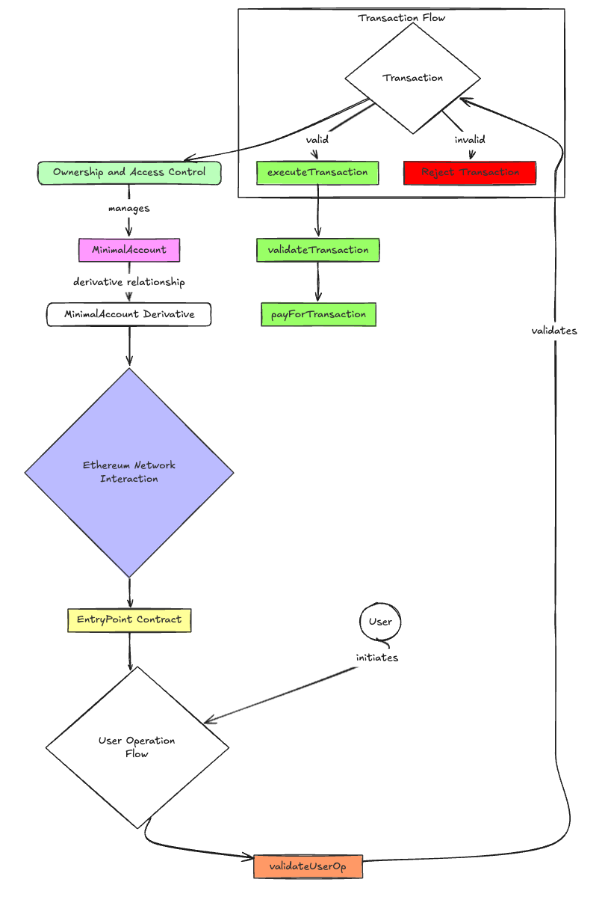

# Smart Contract Account Abstraction Implementation

This repository contains implementations of smart contract accounts for both Ethereum (ERC-4337) and zkSync networks, demonstrating account abstraction patterns.

## Overview

The project implements two main smart contract accounts:

- `MinimalAccount.sol`: An ERC-4337 compliant smart contract account for Ethereum
- `ZkMinimalAccount.sol`: A smart contract account implementation for zkSync

Both implementations demonstrate:

- Owner-based authentication
- Transaction validation
- Execution of arbitrary transactions
- Gas payment handling

## Account Abstraction Flowchart

Below is a flowchart that illustrates the account abstraction process:



## Project Structure

```
src/
├── ethereum/
│   └── MinimalAccount.sol       # ERC-4337 implementation
└── zksync/
    └── ZkMinimalAccount.sol     # zkSync implementation

test/
├── ethereum/
│   └── MinimalAccountTest.t.sol # Ethereum tests
└── zksync/
    └── ZkMinimalAccountTest.t.sol # zkSync tests

script/
├── DeployMinimal.s.sol         # Deployment script
├── HelperConfig.s.sol          # Network configuration
└── SendPackedUserOp.s.sol      # UserOperation helper
```

## Key Features

### MinimalAccount (Ethereum)

- ERC-4337 compliant implementation
- Supports packed user operations
- Owner-based signature validation
- Supports EntryPoint for transaction handling

### ZkMinimalAccount (zkSync)

- Native zkSync account implementation
- Transaction validation and execution
- SystemContract integration
- Owner-based access control

## Prerequisites

- Foundry
- Make
- Node.js & Yarn
- zkSync CLI (for zkSync deployment)

## Installation

1. Clone the repository:

```bash
git clone <repository-url>
```

2. Install dependencies:

```bash
make install
```

## Testing

### Ethereum Tests

```bash
make test
```

### zkSync Tests

```bash
make zktest
```

## Deployment

### Ethereum Deployment

```bash
make deployEth
```

### zkSync Deployment

```bash
make zkdeploy
```

## Development Commands

- `make anvil`: Start local Ethereum node
- `make zkanvil`: Start local zkSync node
- `make build`: Build Ethereum contracts
- `make zkbuild`: Build zkSync contracts
- `make format`: Format code
- `make flatten`: Flatten contracts

## Security

This codebase includes several security considerations:

- Owner-based access control
- Signature validation
- Gas limit checks
- EntryPoint validation

⚠️ **Note**: These contracts are for educational purposes and have not been audited. Use at your own risk.

## License

MIT

## Contributing

Contributions are welcome! Please feel free to submit a Pull Request.
